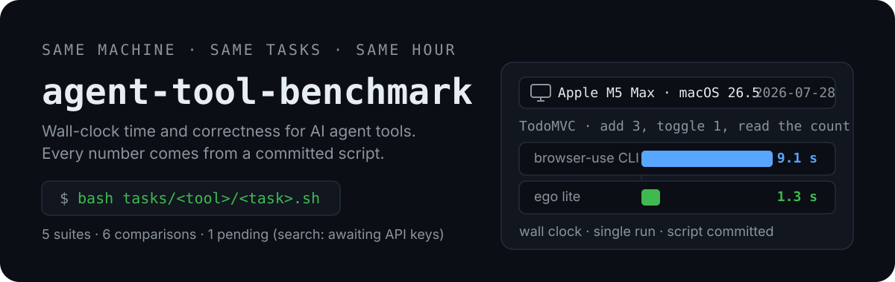

  

  
  

Every benchmark here is a real run on real tools — same machine, same task suite, same hour. Each one ships with its full methodology, rerunnable task scripts, fixtures, and honest limitations, so you can reproduce the numbers instead of trusting a vendor chart.

## Benchmarks

| Category | Comparison | Date | Verdict |
| --- | --- | --- | --- |
| [browser](browser/) | [ego lite vs browser-use CLI](browser/ego-lite-vs-browser-use/) | 2026-07-28 | ego lite wins for local everyday agent tasks (cross-origin iframe piercing, parallel Spaces, zero tab interference); browser-use CLI remains the only option for servers, CI, and cross-platform |
| [editing](editing/) | [udiff vs SEARCH/REPLACE vs str_replace vs apply_patch vs Cline vs whole-file](editing/edit-apply-formats/) | 2026-08-19 | git apply / GNU patch remain the only appliers with zero silent corruptions across 13 scenarios; Cline's fallback ladder and whole-file rewrite tie for most corruptions (4); three appliers silently append a trailing newline; OpenAI apply_patch safely rejects overlapping hunks but corrupts tab-indented files |
| [documents](documents/) | [pymupdf4llm vs markitdown vs docling vs pdftotext](documents/pdf-to-markdown/) | 2026-08-19 | pymupdf4llm wins outright: 9/10 headings, correct two-column order, byte-exact CJK, ~1 s/doc at ~120 MB; docling matches structure but needs ~10 s/doc + 6 GB and silently maps CJK ideographs to lookalike radicals; markitdown/pdftotext emit plain text (0 headings) |
| [retrieval](retrieval/) | [ripgrep vs ctags vs tree-sitter vs jedi (find-all-references)](retrieval/code-search/) | 2026-08-19 | jedi: perfect precision, follows re-exports and separates same-named methods, but blind to getattr dispatch; ripgrep: highest recall (0.95) including string-based dispatch, half its hits are noise; ctags indexes definitions, not references (0.00 recall); an aliased constructor call defeated all four tools |
| [retrieval](retrieval/) | [zg (zvec-grep) hybrid vs BM25 vs ripgrep (NL intent → code)](retrieval/intent-search/) | 2026-09-07 | On 12 natural-language intent queries over requests v2.32.3, zg answered 11–12/12 vs ripgrep's 6/12 — the vocab-gap tier is binary (zg 3–4/4, rg 0/4); but zg costs ~360 tokens and ~1.6 s per query vs rg's ~46 tokens at 5 ms, and pure BM25 --fts matched hybrid, so the official tool-call-reduction claim rests on avoided agent round-trips, which this does not measure |
| [search](search/) | [Exa vs Tavily vs Serper vs Brave vs Firecrawl vs Jina](search/search-apis/) | pending | Harness + query suite committed; awaiting API keys for a captured run — no numbers published until then |

## Principles

- **Same machine, same tasks.** Every tool in a comparison runs the identical task suite on the identical hardware, within the same session.
- **Reproducible.** All task scripts and fixtures are committed. `bash tasks/<tool>/<task>.sh` reruns any measurement.
- **Honest about limits.** Single runs, network variance, and untested modes (such as autonomous LLM planning) are stated, not hidden.
- **No invented numbers.** Every figure in every chart comes from a captured run. Vendor claims are labeled as claims.

## Planned

- Agent terminal and sandbox execution environments
- Spreadsheet agent tools
- Search-API captured run (harness ready, awaiting keys)

  

## License

MIT
