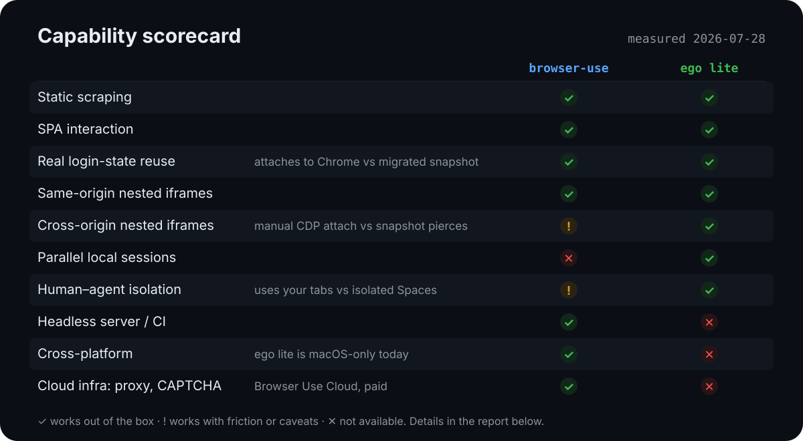
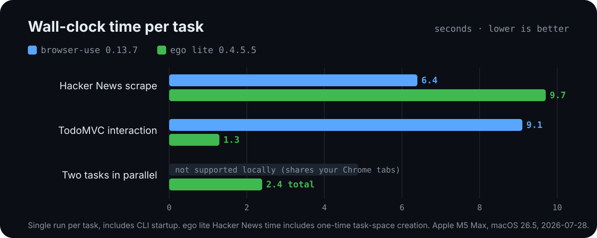

# ego lite vs browser-use CLI

Same-machine, same-task benchmark of two agent-browser tools, run on 2026-07-28.

**TL;DR** — Both tools passed basic scraping, SPA interaction, and real login-state reuse. The gaps are structural: ego lite's `snapshotText()` pierces **cross-origin nested iframes** transparently where browser-use needs hand-written CDP target attachment, and ego lite runs **parallel isolated Spaces** locally while browser-use local mode works inside your real Chrome tabs. browser-use keeps the server, CI, cross-platform, and cloud-infrastructure story to itself.

<p align="center">
  
</p>

<p align="center">
  
</p>

## Environment

| Item | Value |
| --- | --- |
| Date | 2026-07-28 |
| Machine | Apple M5 Max, macOS 26.5 (Darwin 25.5.0) |
| browser-use CLI | browser-use 0.13.7 (Browser Harness 0.1.8), attached to the local real Chrome over CDP |
| ego lite | ego-browser 0.4.5.5 / Chromium 150.0.7871.101 / Node v24.18.0 |
| ego lite setup | First launch migrated Chrome data (login state + localStorage) |

Both tools were driven by scripts (the agent writes code that executes multiple steps in one pass), not by autonomous LLM planning. This measures **tool capability and ergonomics**, not model success rates.

## Task design

| # | Task | What it probes |
| --- | --- | --- |
| 1 | Hacker News: top 5 titles + points | Static scraping baseline |
| 2 | TodoMVC: add 3 items, toggle 1, read the count | JS-heavy interaction, form reliability |
| 3 | Open github.com, read the logged-in username | Real login-state reuse |
| 4a | Extract a secret string from a same-origin double-nested iframe | Frame piercing |
| 4b | Same, but the inner iframe is **cross-origin** | OOPIF handling (ego lite's claimed strength) |
| 5 | Parallel run + interference observation | Sharing a browser with a human |

The iframe fixtures live in [`fixtures/`](fixtures/), served locally with `python3 -m http.server 8973` (outer) and `8974` (cross-origin inner).

## Results

| Task | browser-use CLI | ego lite |
| --- | --- | --- |
| 1. HN top 5 | ✅ 6.4s, 2 invocations | ✅ 9.7s, 1 invocation (includes Space creation) |
| 2. TodoMVC | ✅ 9.1s | ✅ 1.3s (clean state) |
| 3. GitHub login | ✅ got the username | ✅ got the username (migrated data works) |
| 4a. Same-origin iframes | ✅ `contentDocument` pierces directly | ✅ same |
| 4b. Cross-origin iframes | ⚠️ `js()` returns None; needs hand-written CDP `Target.attachToTarget` | ✅ **`snapshotText()` surfaces the inner text in the semantic tree, zero extra work** |
| 5. Parallelism | ✗ shares your real Chrome tabs; parallel requires their paid cloud | ✅ two Spaces concurrently (1.5s / 2.4s), user's windows untouched |

Timings are `time` wall-clock measurements including CLI startup. Absolute values are subject to network variance; magnitudes and relative ordering are the signal.

## Key findings

1. **Cross-origin nested iframes are a real gap.** The browser-use path requires the agent to understand OOPIF and CDP target attachment — an easy place for a model to burn rounds in trial and error. ego lite delivers it in a single `snapshotText()`.
2. **Space isolation + local parallelism is unique to ego lite.** browser-use local mode opens and closes tabs inside your Chrome, visibly; ego lite runs everything in background Spaces.
3. **ego lite's Chrome migration is a snapshot copy.** It even carried over the TodoMVC localStorage left by our browser-use run (the first ego pass showed 6 duplicated todos because of it). After migration the two browsers diverge independently — mind session-sensitive sites like banking.
4. **Ergonomic paper cuts.** browser-use: `close_tab("current")` alias doesn't resolve (needs a real target id), and the help text's `evaluate` is actually named `js`. ego lite: first run requires GUI onboarding — no pure-CLI path — and it is macOS-only.

## Verdict

- **Local everyday agent tasks (macOS):** ego lite — login state, isolation, parallelism, and iframe piercing all measured better.
- **Servers / CI / cross-platform / proxy + CAPTCHA infrastructure:** browser-use CLI is the only option.
- Both are free and not mutually exclusive; split them by scenario.

## Reproduce

```bash
# browser-use
uv tool install --python 3.12 browser-use
bash tasks/browser-use/01-hn.sh   # then 02-04

# ego lite (macOS; install the app and finish GUI onboarding first)
# download: https://github.com/citrolabs/ego-lite
bash tasks/ego/01-hn.sh           # then 02-05

# iframe fixtures
python3 -m http.server 8973 --directory fixtures &
python3 -m http.server 8974 --directory fixtures &
```

## Limitations

- Single machine, single run per task — no averaging; network variance uncontrolled.
- Tasks were completed by hand-written scripts. Autonomous LLM-planning mode
  (token cost, success rate) was not measured. ego's official 2.5× speed claim
  is measured against Vercel's agent-browser and credits composing a multi-step
  task as code rather than driving a call-and-wait CLI loop; this benchmark ran
  scripted tasks, not LLM planning, so it neither confirms nor refutes that
  claim.
- The results table restates the single-run measurements taken for this suite;
  the committed charts (`assets/timings.svg`, `assets/scorecard.svg`) plot
  them, but the per-task CLI output and `time` logs were not committed.
- ego's official comparison table says browser-use does not inherit Chrome data; in our test browser-use local mode attaches to the real Chrome and login state simply works. The real difference is **isolation**, not login-state availability.
